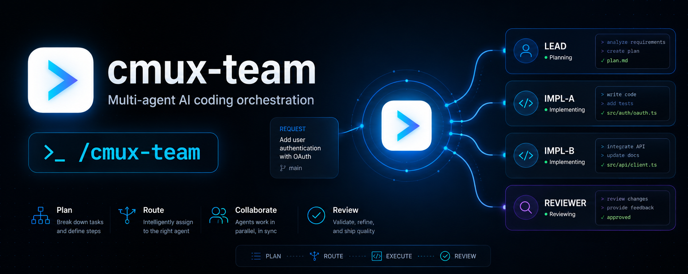

# cmux-team

**A staffing planner that designs your multi-agent [cmux](https://cmux.com) team
and hands you an executable launch kit.** Give it a coding objective; it returns
the optimal roster — every agent's **role**, **model**, **thinking level**, and
**count** — plus a ready-to-run **launch kit** under `.cmux-team/<slug>/`: a lead
prompt, one worker prompt per teammate, and a one-line launcher. You review the
kit, then run the launcher yourself. It never starts the work itself.

📄 **Docs & guide:** https://nicholasspisak.github.io/cmux-team/
🎓 **Learn to operate AI agent teams:** [AI Operator Academy](https://www.skool.com/aioperatoracademy/about)

## Why

"Spinning up agents" quietly makes four decisions you should make on purpose:
which model per role, how hard each should think, how many agents, and whether
you even need a team. `cmux-team` makes those decisions explicit as a reviewable
spec — a human gate before any tokens are spent. Then, unlike a plan you'd have
to hand-assemble yourself, it goes one step further: it writes the actual
launch kit, so the only thing standing between the plan and a running team is
one command you choose to run.

## What you get — a real team, not a prompt

Older staffing tools stop at an inert prose block you'd paste into a chat. This
one emits something you can execute:

- **A real team standup, not a suggestion.** `bash .cmux-team/<slug>/launch.sh`
  cold-starts cmux if needed, boots the LEAD agent, and the LEAD spawns every
  worker into its own pane and coordinates them — no copy-pasting prompts by hand.
- **Observability by default.** Each worker gets a **named pane** (lead, build-be,
  build-fe, test, …), live status/progress chips (`cmux set-status` /
  `cmux set-progress`), and desktop notifications on ready/done/blocked
  (`cmux notify`) — you can watch the team work instead of guessing.
- **Diverse-build + judge quality.** The default topology runs independent
  implementations from different model families in isolated worktrees, then has
  the lead judge them blind on a rubric and synthesize the best of each.
- **Right-sized staffing.** Every extra agent is real tokens — the planner
  staffs 3–6 agents for real work, or a team of one when the task is trivial.
- **The human review gate is preserved.** The skill still HALTS after writing
  the kit. It never runs the launcher for you — you review the roster and
  prompts under `.cmux-team/<slug>/`, adjust them, and launch it yourself.

## Prerequisites

- The [cmux](https://cmux.com/docs/getting-started) app + CLI, with the official
  `/cmux` skills installed (`cmux docs` should work).
- A coding agent (Claude Code, Codex, etc.).

## Install

```bash
npx skills add NicholasSpisak/cmux-team
```

This installs the skill into each detected agent's skills directory (via the
[Vercel skills](https://github.com/vercel-labs/skills) ecosystem).

## Use

```
/cmux-team "add rate limiting to the POST /orders endpoint"
```

You get a roster table and a launch kit written to `.cmux-team/rate-limit-orders/`:
`lead.md`, one `worker-<role>.md` per teammate, `launch.sh`, and `roster.md`.
Review the kit, adjust models/counts/tasks, then run the printed launch line
yourself:

```
bash .cmux-team/rate-limit-orders/launch.sh
```

That one line opens cmux, boots the lead agent, and the lead spawns every
worker into its own named pane and coordinates them to completion. See
[`skills/cmux-team/assets/example-plan.md`](skills/cmux-team/assets/example-plan.md)
for the full worked example.

## How it stays current

cmux specifics are vendored in [`skills/cmux-team/references/`](skills/cmux-team/references/) as snapshots with a
provenance header (source + captured `cmux version` + date). Refresh them after a
cmux update:

```bash
./scripts/sync-cmux-refs.sh
```

Run it **from inside a cmux terminal surface**. The `cmux --help` and `cmux docs`
captures work anywhere, but `cmux capabilities` is socket-backed and only answers
a trusted caller — outside a cmux surface it records a graceful "unavailable"
note instead. The script auto-discovers the running app's socket from
`/tmp/cmux-last-socket-path` when it can.

## Contributing

No CI runs in the cloud — **there are no GitHub Actions**. Everything is checked
locally before you push:

```bash
./scripts/check.sh        # must exit 0 before committing
```

`check.sh` validates the skill frontmatter, absence of placeholders, that every
referenced file exists, snapshot provenance + staleness (snapshot `cmux version`
must match your installed one), docs SEO + self-containment, and that no
`.github/workflows/` directory exists. If the staleness check fails, run
`./scripts/sync-cmux-refs.sh` (from a cmux surface) and commit the refreshed
snapshots. Keep model IDs in `skills/cmux-team/references/staffing-heuristics.md`
— that is their single source of truth.

## License

[MIT](LICENSE) © Nicholas Spisak
